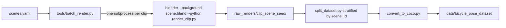

# 2D keypoint detection pipeline organization
_Exported on 4/30/2026 at 12:28:59 GMT+2 from Cursor (3.1.14)_

---

**User**

hey chat, i have alot of blender files now for processing the raw models into animatable systems for gathering synthetic keypoint data. I now need to render the videos and attach annotations to these videos.

I need to organize the file structures so that they will work with 2D keypoint detectors that are usually developed for human pose estimation. Most of them use COCO format for the data structuring. 
Suggest and build a pipeline for creating the folder that adheres to the training requirements of 2D keypoint detectors (keep in mind that the next step after 2D keypoint detection will be 3D keypoint detection)

I havent decided on a good 2D keypoint detection algorithm yet. There is no need for online/realtime analysis, everything can be done offline. Look up openly available/opensource 2D keypoint detectors and suggest viable options.

---

**Cursor**

Before I plan, let me also peek at the .gitignore and any leftover files to make sure I don't miss anything important.

Got it. I now have a clear picture: you have a Blender pipeline that rigs the bicycle and Mixamo character, animates from CSV at 60 fps, randomizes a camera, and writes one per-frame JSON of 18 bicycle keypoints + a PNG sequence under `2D annotated videos/`. Before I commit to a plan there are two decisions that fork the dataset design significantly. Let me ask.

> **Which keypoints should the 2D dataset contain? This determines the COCO category schema, the choice of detector, and how 3D lift-up will work later.**
> - Bicycle keypoints only (the 18 k_* points you already export). Simplest; closest to a rigid-object pose problem. ✔
> - Bicycle + rider keypoints, as TWO separate COCO categories per image (recommended for downstream 3D bike pose because the rider provides strong geometric cues, and human-pose detectors transfer well).
> - Bicycle + rider keypoints fused into ONE skeleton/category (single mega-skeleton). Simpler training, but loses the option to use pretrained human-pose backbones for the rider.
> - Unsure - explain the trade-offs and recommend one in the plan.

> **How do you want to organize renders into 'samples'? This drives the folder layout and the train/val/test split strategy.**
> - One camera per animation clip (current behavior of randomize_camera.py). Each clip = one video = one continuous frame sequence. ✔
> - Multiple randomized cameras per animation clip (re-render the same animation from N viewpoints). Gives multi-view supervision for free and is great for 3D evaluation.
> - Support both - layout should not assume a fixed N, just record camera id per sample.

Got it - bicycle-only keypoints, single camera per clip. Let me put together the plan.

---

**User**

I plan on making the scenes myself with differing bicycles + rider combinations present. I also manually make the bicycles movement via the mujoco files, then import them manually into the scene

Make the plan so that the randomized renderer can load different scenes

---

**Cursor**

I'll update the plan file directly to add scene-pool support to the renderer.

Now let me update the body of the plan with the scene-pool driver design, registry format, clip-id scheme, and updated diagram.

Plan is updated. The key changes versus the previous version:

- Renderer now expects a **pool** of hand-built `.blend` scenes (one per bike+rider combo, with the MuJoCo motion already baked in via `Animate_script.py`) instead of a single scene.
- New [Blender files/Scenes/scenes.yaml](Blender%20files/Scenes/scenes.yaml) registry is the only opt-in mechanism, so half-finished scenes are never sampled. Each entry carries `id`, `blend`, `bike`, `rider`, optional `frame_range`, optional `camera_target`, optional sampling `weight`.
- New `tools/batch_render.py` (outside Blender) does the sampling: `--num-clips N --seed S` weighted-samples scenes, then spawns one `blender --background <blend> --python tools/render_clip.py` subprocess per clip. Resumable via existing-output-dir check, with a manifest CSV.
- Clip ids are now `clip_<scene_id>_<seed:08d>`, so every clip is traceable back to its source scene and reproducible across machines.
- `randomize_camera.py` becomes deterministic via a `CAMERA_SEED` env var, and reads its `camera_target` from the registry instead of hardcoding `k_handlebar_middle`.
- Train/val/test split is **stratified by `scene_id`** so a single bike-rider combo can't end up entirely in train and silently inflate the model's apparent accuracy.
- The `.gitignore` change now also explicitly tracks `Blender files/Scenes/scenes.yaml` while still ignoring the heavy `.blend` files.

Pipeline overview reflecting the new flow:



Let me know if you'd like to tweak anything (e.g. should `batch_render.py` also randomize HDRI/world lighting per clip, or do you prefer all such variation to live inside the hand-built scenes?), otherwise tell me to start building.

---

**User**

The only randomization the tool needs to do is randomiz the camera angle with the @Blender files/randomize_camera.py script. Is that in the plan? 

---

**Cursor**

Yes, that is exactly what the plan does - the only per-clip randomization is the camera. Three places in the plan lock this in:

- "Workflow assumed by this plan" section: *"From then on, the renderer randomizes only the camera (and re-rolls per clip), and treats the rest of the scene as immutable input data."*
- Concrete file change #4: refactor [Blender files/randomize_camera.py](Blender%20files/randomize_camera.py) to accept a `CAMERA_SEED` env var so each clip's camera angle is reproducible, and to read `camera_target` from the registry entry.
- Concrete file change #5: `tools/render_clip.py` runs `randomize_camera.py` first, then renders, then exports - no other randomization step exists in the per-clip pipeline.

The diagram also shows only `randomize_camera.py CAMERA_SEED` inside each per-clip Blender subprocess; there is no HDRI / lighting / material / animation-offset randomization anywhere.

The earlier "should batch_render also randomize HDRI" was a question I was asking you, not something the plan does. Your answer (camera only) means no plan change is needed - the plan already reflects that.

If you want, I can drop that open question entirely from the plan so there's no ambiguity. Otherwise the plan is ready - say the word and I'll start executing.

---

**User**

Implement the plan as specified, it is attached for your reference. Do NOT edit the plan file itself.

To-do's from the plan have already been created. Do not create them again. Mark them as in_progress as you work, starting with the first one. Don't stop until you have completed all the to-dos.

---

**Cursor**

I’ll start implementing the plan from the first todo and keep the edits scoped to the dataset/render pipeline. First I’m going to add the shared bicycle keypoint schema, then wire the Blender exporter and renderer around it.

I’m creating the shared schema now. This will make the Blender exporter, COCO converter, and visualizer agree on one fixed 18-keypoint order.

Next I’m adding the scene registry loader and an initial `scenes.yaml` that points at the existing renderable scene files. It will validate ids and `.blend` paths, then sample scenes deterministically for batch rendering.

The registry is in place. I’m rewriting the Blender annotation exporter so each render clip gets per-frame 2D JSON, `camera.json`, `keypoints_3d.jsonl`, and `render_config.json` under `raw_renders/<clip_id>/`.

The exporter and camera randomizer are wired for deterministic camera-only randomization. I’m adding the in-Blender render entrypoint next, so batch jobs can open a scene, reroll the camera, render PNG frames, and export annotations in one Blender process.

The single-clip Blender entrypoint is added. I’m adding the outside-Blender batch driver now; it will sample scene entries, assign reproducible clip ids, and call Blender headlessly for each clip.

Batch rendering is in place. I’m adding the clip-level split tool next, with scene-id stratification when there are enough clips per scene.

The splitter is done. I’m adding the COCO converter now; it will normalize rendered frames into `images/<split>/<clip_id>/`, build COCO `annotations/*.json`, and copy 3D/camera metadata for Stage 2.

The COCO converter is added. I’m adding the COCO visualizer now so overlays are generated from the final training annotations, not the old raw per-frame JSON format.

The visualizer is added. I’m writing the dataset README now with the schema, the scene registry workflow, and short detector integration notes.

The README is done. I’m updating `.gitignore` last so generated renders and datasets stay out of git while the lightweight registry and documentation remain trackable.

All planned files are now implemented. I’m running syntax checks and a registry validation pass, then I’ll inspect linter diagnostics for the edited files.

The first validation command found that this machine exposes Python as `python3`, not `python`. I’m rerunning the same checks with `python3`.

The syntax checks and registry validation passed, and there are no linter diagnostics. I’m making one small compatibility adjustment so `camera.json` and `keypoints_3d.jsonl` include the exact compact fields described in the plan (`R`, `t`, `kps_world`) in addition to the richer metadata.

Implemented the full pipeline from the plan, without editing the plan file.

Added:
- `tools/bicycle_keypoint_schema.py`
- `tools/scene_registry.py`
- `tools/render_clip.py`
- `tools/batch_render.py`
- `tools/split_dataset.py`
- `tools/convert_to_coco.py`
- `tools/visualize_coco.py`
- `Blender files/Scenes/scenes.yaml`
- `data/bicycle_pose_dataset/README.md`

Updated:
- `Blender files/randomize_camera.py` now supports deterministic camera-only randomization via `CAMERA_SEED` and configurable `CAMERA_TARGET`.
- `Blender files/extract_2D_annotation.py` now exports raw clip annotations, `camera.json`, `keypoints_3d.jsonl`, and `render_config.json`.
- `.gitignore` now ignores generated `raw_renders/` and generated dataset outputs while allowing `scenes.yaml` and the dataset README to be tracked.

Validation passed:
- `python3 -m py_compile ...`
- `python3 tools/scene_registry.py`
- `python3 tools/scene_registry.py --sample 1 --seed 1`
- No linter errors found.

I did not run an actual Blender render, since that would be heavier and depends on the scene content being ready. Note: because the legacy `2D annotated videos/` ignore rule was removed per plan, that existing generated folder now shows as untracked.

---

**User**

alright cool. How do i now use this new tool? is there a python file that I run?

---

**Cursor**

Yes. The main file you run is:

```bash
python3 tools/batch_render.py --num-clips 20 --seed 42 --encode-video
```

That samples scenes from `Blender files/Scenes/scenes.yaml`, opens each `.blend` in Blender headlessly, randomizes only the camera with `Blender files/randomize_camera.py`, renders frames, and writes raw output to `raw_renders/<clip_id>/`.

Typical full workflow:

```bash
# 1. Check your scene registry
python3 tools/scene_registry.py

# 2. Render raw clips
python3 tools/batch_render.py --num-clips 20 --seed 42 --encode-video

# 3. Make train/val/test split
python3 tools/split_dataset.py --seed 42

# 4. Convert raw renders into COCO format
python3 tools/convert_to_coco.py

# 5. Optional: visualize COCO labels
python3 tools/visualize_coco.py \
  --coco data/bicycle_pose_dataset/annotations/train.json \
  --encode-video
```

Before running, edit `Blender files/Scenes/scenes.yaml` so it lists only the `.blend` scenes you want to render.

If Blender is not available as `blender` in your terminal, pass the path:

```bash
python3 tools/batch_render.py --num-clips 20 --seed 42 --blender /path/to/blender
```

Do not run `tools/render_clip.py` directly with normal Python; `batch_render.py` calls it inside Blender.

---

**User**

how do I make blender able to be run headless?

---

**Cursor**

Blender can run headless with its built-in `--background` flag. You just need the `blender` executable available in your terminal.

Check if it works:

```bash
blender --background --version
```

If that prints a Blender version, you’re ready. Then this repo can run:

```bash
python3 tools/batch_render.py --num-clips 5 --seed 42
```

If `blender` is not found, install it or pass the full path:

```bash
python3 tools/batch_render.py \
  --num-clips 5 \
  --seed 42 \
  --blender /path/to/blender
```

Common Linux install options:

```bash
sudo apt install blender
```

or, if you downloaded Blender from blender.org:

```bash
/path/to/blender/blender --background --version
```

For servers without a display, Blender’s `--background` mode usually does not need X/Wayland. If GPU rendering gives display-related errors, switch the scene render device to CPU in Blender first, or run with software OpenGL only if needed.

---

**User**

haye@hayelaptop:~$ blender --background --version
Blender 5.1.0 (hash adfe2921d5f3 built 2026-03-17 01:31:26)
Blender 5.1.0
	build date: 2026-03-17
	build time: 01:31:26
	build commit date: 2026-03-16
	build commit time: 18:50
	build hash: adfe2921d5f3
	build branch: blender-v5.1-release
	build platform: Linux
	build type: Release
	build c flags:  -Wall -Werror=implicit-function-declaration -Wstrict-prototypes -Werror=return-type -Werror=vla -Wmissing-prototypes -Wno-char-subscripts -Wno-unknown-pragmas -Wpointer-arith -Wunused-parameter -Wwrite-strings -Wlogical-op -Wundef -Winit-self -Wmissing-include-dirs -Wno-div-by-zero -Wtype-limits -Wformat-signedness -Wrestrict -Wno-stringop-overread -Wno-stringop-overflow -Wnonnull -Wabsolute-value -Wuninitialized -Wredundant-decls -Wshadow -Wimplicit-fallthrough=5 -Wno-error=unused-but-set-variable  -march=x86-64-v2 -std=gnu11 -pipe -fPIC -funsigned-char -fno-strict-aliasing -ffp-contract=off  
	build c++ flags:  -Wuninitialized -Wredundant-decls -Wall -Wno-invalid-offsetof -Wno-sign-compare -Wlogical-op -Winit-self -Wmissing-include-dirs -Wno-div-by-zero -Wtype-limits -Werror=return-type -Wno-char-subscripts -Wno-unknown-pragmas -Wpointer-arith -Wunused-parameter -Wwrite-strings -Wundef -Wcomma-subscript -Wformat-signedness -Wrestrict -Wno-suggest-override -Wuninitialized -Wno-stringop-overread -Wno-stringop-overflow -Wimplicit-fallthrough=5 -Wundef -Wmissing-declarations  -march=x86-64-v2 -pipe -fPIC -funsigned-char -fno-strict-aliasing -ffp-contract=off  
	build link flags:  -Wl,--version-script='/home/blender/git/blender-v510/blender.git/source/creator/symbols_unix.map' -Wl,--allow-shlib-undefined -Wl,--unresolved-symbols=ignore-in-shared-libs
	build system: CMake


---

**Cursor**

Perfect, Blender is already available headless.

From the repo root, you can run:

```bash
cd ~/3D-bicycle-pose-estimation
python3 tools/scene_registry.py
python3 tools/batch_render.py --num-clips 5 --seed 42 --encode-video
```

That will use your installed `blender` automatically.

Then convert to COCO:

```bash
python3 tools/split_dataset.py --seed 42
python3 tools/convert_to_coco.py
```

One thing to check first: `Blender files/Scenes/scenes.yaml` currently has placeholder `rider: unknown` tags. That won’t break rendering, but update the `bike`, `rider`, and `notes` fields when you want cleaner metadata in `render_config.json`.

